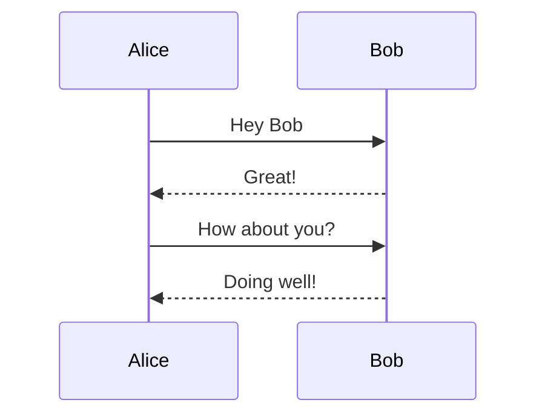

# Spec-Up Example

**Specification Status:** Strawman

**Latest Draft:**
[https://csuwildcat.github.io/spec-up](https://csuwildcat.github.io/spec-up)

**Editors:**
~ [Daniel Buchner](https://www.linkedin.com/in/dbuchner/)

<!-- -->

**Participate:**
~ [GitHub repo](https://github.com/csuwildcat/spec-up)
~ [File a bug](https://github.com/csuwildcat/spec-up/issues)
~ [Commit history](https://github.com/csuwildcat/spec-up/commits/master)

---

## Abstract

Let's face it, other tools and generators for writing technical specifications aimed at standards bodies or industry groups are cumbersome, underwhelming, and lack the features you might want in a technical specification document. Spec-Up's goal is to deliver you a better spec-writing experience with far less effort and tedium than other tools in the ecosystem. Spec-Up is a dead simple tool that auto-generates great specs from markdown. The version of markdown Spec-up uses contains all the same features you might expect from common implementations, like GitHub, but adds much more, including notice blocks, complex tables, charts, advanced syntax highlighting, UML diagrams, etc.

## Getting Started

Using Spec-Up is easy peasy lemon squeezy:

1. `npm install spec-up`
2. Create a subdirectory in your project with two files:
   - `spec.json` - add some basic config values, like your desired HTML page title, etc.
   - `spec.md` - write the markdown version of your spec here (duh)
3. In your main node.js file, drop in this bad boy: `require('spec-up')()`

Boom! That's it. Spec-Up will auto-detect the location of your spec files and auto-generate your spec's HTML version every time you hit save after editing your `spec.md` files. Did I mention you can have multiple specs located at any depth in your project and Spec-Up will crawl up in there and render all those specs like a damn boss? Well it does, because why the hell not.

## Feature Flexin

In addition to all the normal markdown support (things like headings, lists, etc.), which you can see in this example document and all over GitHub readme pages, Spec-Up integrates a ton of other useful features that make it easy to articulate your technical content. Let's checkout some of the goodies:

### Table of Contents

<-- You see that beautiful TOC over there to your left? (tap the header link to slide it out on mobile) Yeah, you don't need to do a damn thing, that just magically appears based on your use of `h2`, `h3`, and `h4` headings.

### Notices

<pre>
::: note Basic Note
  Check this out.
:::
</pre>

::: note Basic Note
Check this out.
:::

<pre>
::: issue Issue Notice
  I take issue with that, kind sir.
:::
</pre>

::: issue Issue Notice
I take issue with that, kind sir.
:::

<pre>
::: warning Warning Notice
  Houston, I think we have a problem
:::
</pre>

::: warning Warning Notice
Houston, I think we have a problem
:::

<pre>
::: example Code Example
  Put your code block here
:::
</pre>

::: example Code Example
Put your code block here
:::

### Tables

<pre>
Stage | Direct Products | ATP Yields
----: | --------------: | ---------:
Glycolysis | 2 ATP ||
^^ | 2 NADH | 3--5 ATP |
Pyruvaye oxidation | 2 NADH | 5 ATP |
Citric acid cycle | 2 ATP ||
^^ | 6 NADH | 15 ATP |
^^ | 2 FADH2 | 3 ATP |
**30--32** ATP |||
[Net ATP yields per hexose]
</pre>

|              Stage | Direct Products | ATP Yields |
| -----------------: | --------------: | ---------: |
|         Glycolysis |           2 ATP |            |
|                 ^^ |          2 NADH |   3--5 ATP |
| Pyruvaye oxidation |          2 NADH |      5 ATP |
|  Citric acid cycle |           2 ATP |            |
|                 ^^ |          6 NADH |     15 ATP |
|                 ^^ |         2 FADH2 |      3 ATP |
|     **30--32** ATP |                 |            |

[Net ATP yields per hexose]

<pre>
|--|--|--|--|--|--|--|--|
|♜|  |♝|♛|♚|♝|♞|♜|
|  |♟|♟|♟|  |♟|♟|♟|
|♟|  |♞|  |  |  |  | |
|  |♗|  |  |♟|  |  | |
|  |  |  |  |♙|  |  | |
|  |  |  |  |  |♘|  | |
|♙|♙|♙|♙|  |♙|♙|♙|
|♖|♘|♗|♕|♔|  |  |♖|
</pre>

|--|--|--|--|--|--|--|--|
|♜| |♝|♛|♚|♝|♞|♜ |
| |♟|♟|♟| |♟|♟|♟ |
|♟| |♞| | | | | |
| |♗| | |♟| | | |
| | | | |♙| | | |
| | | | | |♘| | |
|♙|♙|♙|♙| |♙|♙|♙ |
|♖|♘|♗|♕|♔| | |♖ |

### Diagrams

<pre>

</pre>


### Charts

<pre>
```chart
{
  "type": "pie",
  "data": {
    "labels": [
      "Red",
      "Blue",
      "Yellow"
    ],
    "datasets": [
      {
        "data": [
          300,
          50,
          100
        ],
        "backgroundColor": [
          "#FF6384",
          "#36A2EB",
          "#FFCE56"
        ],
        "hoverBackgroundColor": [
          "#FF6384",
          "#36A2EB",
          "#FFCE56"
        ]
      }
    ]
  }
}
```
</pre>

```chart
{
  "type": "pie",
  "data": {
    "labels": [
      "Red",
      "Blue",
      "Yellow"
    ],
    "datasets": [
      {
        "data": [
          300,
          50,
          100
        ],
        "backgroundColor": [
          "#FF6384",
          "#36A2EB",
          "#FFCE56"
        ],
        "hoverBackgroundColor": [
          "#FF6384",
          "#36A2EB",
          "#FFCE56"
        ]
      }
    ]
  }
}
```

### Syntax Highlighting

<pre>
```json
{
  "@context": "https://www.w3.org/ns/did/v1",
  "id": "did:example:123456789abcdefghi",
  "authentication": [{
    
    "id": "did:example:123456789abcdefghi#keys-1",
    "type": "RsaVerificationKey2018",
    "controller": "did:example:123456789abcdefghi",
    "publicKeyPem": "-----BEGIN PUBLIC KEY...END PUBLIC KEY-----\r\n"
  }],
  "service": [{
    
    "id":"did:example:123456789abcdefghi#vcs",
    "type": "VerifiableCredentialService",
    "serviceEndpoint": "https://example.com/vc/"
  }]
}
```
</pre>

```json
{
  "@context": "https://www.w3.org/ns/did/v1",
  "id": "did:example:123456789abcdefghi",
  "authentication": [
    {
      "id": "did:example:123456789abcdefghi#keys-1",
      "type": "RsaVerificationKey2018",
      "controller": "did:example:123456789abcdefghi",
      "publicKeyPem": "-----BEGIN PUBLIC KEY...END PUBLIC KEY-----\r\n"
    }
  ],
  "service": [
    {
      "id": "did:example:123456789abcdefghi#vcs",
      "type": "VerifiableCredentialService",
      "serviceEndpoint": "https://example.com/vc/"
    }
  ]
}
```
